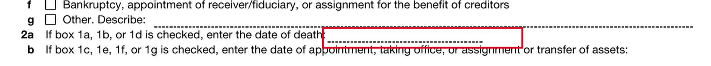

# Anvil, live — Form 56, the XFA hybrid

Anvil is the sponsor runtime. The same approved binding that drives the local `pypdf`
path drives Anvil, with no change to the artifact: `forge fill --via anvil`.

**It works on the hard form.** Not DL 142, which `docs/03-ANVIL.md` recommends starting
with — Form 56, two pages, 76 fields, XFA hybrid. Anvil's field detection found all 72
fillable fields, 39 text and 33 checkbox, exactly matching our calibration.

```
forge anvil-register irs-f56 --binding-version 1
forge fill irs-f56 --estate estate-05-in-formal-probate --via anvil --binding-version 1
```

| | local `pypdf` | Anvil |
|---|---|---|
| Values sent | 32 | 32 |
| Fields populated in the render | 32 | 32 |
| Output | 76 AcroForm fields, XFA retained, `/NeedAppearances` set | flattened, 0 form fields, no XFA |
| Bytes | 176 KB | 157 KB |
| Wall time | 383 ms | 1245 ms |
| Watermark | none | "DEMO Generated by Anvil" (trial account) |

Cast `adHX8qRQPftF9JbPPn0w`, published, recorded in `artifacts/anvil/irs-f56.json`
against the sha256 of the approved binding it was registered from. The cast identifier
lives in its own file rather than on the artifact because
`artifacts/approved/irs-f56.v1.json` is immutable and `chmod 0444` the moment a human
approves it.

Both renders are on disk and were compared by eye, not by reading values back:
`out/renders/fills/` (local) and `out/renders/anvil/` (Anvil). One cosmetic difference:
Anvil draws line 5b's text across the printed dotted rule rather than above it. Every
value that appears on one appears on the other, in the same box.

## Two things that cost real time, recorded so nobody pays them twice

**1. `aliasIds` is a positional list of strings, and the aliases it sets are inert.**

`docs/03-ANVIL.md` says to register the cast with our own aliases so the vocabulary
spans forms. The live schema takes `allowedAliasIds: [String]` (not `allowAliasIds`)
plus `aliasIds: JSON` — and `aliasIds` is **positional**, aligned to Anvil's own
detection order, which is not the AcroForm order and is not guessable. Passing
`[{fieldId, aliasId}]` objects fails validation outright.

Worse, once accepted the aliases do not work. A cast registered with all 72 aliases
echoed them back on `allowedAliasIds`, accepted a fill payload keyed by them, returned
**HTTP 200 and 136 KB of structurally valid PDF — with every one of 32 values silently
dropped**. The same payload keyed by `fieldInfo.fields[].id` rendered correctly.

So the fill payload is keyed by Anvil's internal field id, resolved at fill time by
`anvil.field_id_map()`. Our alias vocabulary still lives in the binding artifact, where
it is the thing a human reads; the id is a last-mile translation we compute and can
therefore verify.

**2. The reconciliation had the same bug it exists to catch.**

Reconciliation compared our aliases against `allowedAliasIds`. Because Anvil echoes
that list back in full, it reported **zero drift on the fill that lost all 32 values.**
The safety check was reading a field that proves nothing.

It now compares against `fieldInfo.fields[].name` — the short PDF field name, which is
what actually determines whether a posted value reaches a box. `tests/test_anvil.py::
test_reconcile_ignores_allowedAliasIds` pins this so it cannot regress.

There is a related trap guarded but not yet exercised: Anvil reports only the *short*
field name, and DL 142 has several fields whose last name segment is `0`
(`docs/00-DOMAIN.md` §3.3). Matching on a colliding short name would file a value into
the wrong box, so `bound_short_names()` refuses rather than guessing. DL 142 will need
a qualified-name mapping before it can go through Anvil.

## The deliberate failure

The realistic drift, not a typo: **the IRS renames a field.** Our approved binding still
names `f1_19[0]` (line 2a, date of death); a cast built from the revised PDF has
`f1_19a[0]`. Nothing errors — the value is simply not delivered.

Reproduce: `python3 anvil_drift_demo.py` (script and report in
`out/demo/anvil-drift/report.json`).

**Before — reconciliation bypassed:**

- 32 values intended, **31 actually sent**, 1 silently dropped
- Anvil returned **156,345 bytes**, valid PDF, HTTP 200, no warning
- `out/demo/anvil-drift/before-no-reconciliation.pdf`

The hole, with everything around it correctly filled:



A reviewer glancing at that page sees a finished Form 56. Line 2a — the decedent's date
of death, on a filing that establishes fiduciary authority — is blank.

**After — reconciliation on:**

```
refusing to fill: the cast does not have these fields we would write
(their values would be SILENTLY dropped and the returned PDF would look
complete): ['f1_19a[0]']
```

- **0 fill requests sent.** Not "sent and discarded" — the HTTP call is never made.
- **No PDF written.** `after-refused.pdf` does not exist.
- Drift reported in both directions: `boundButMissingFromCast: ['f1_19a[0]']`, and
  `inCastButNeverBound` names `f1_19[0]` alongside the 5 fields we deliberately left
  unbound.

That asymmetry is the point. `boundButMissingFromCast` is fatal, because those values
vanish. `inCastButNeverBound` is reported and allowed, because a field we chose not to
bind is a documented decision, not a surprise.
