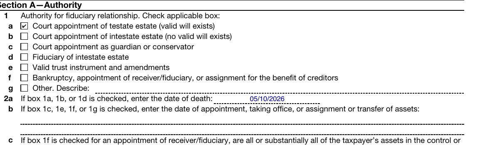
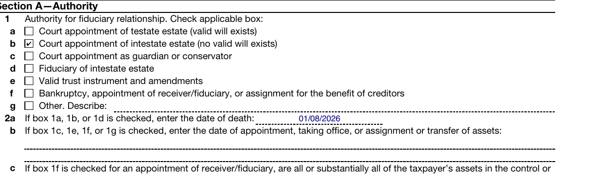
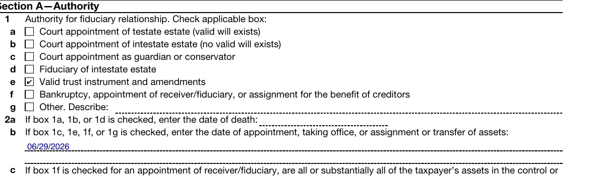

# Same binding, different estates — Form 56 Section A

One approved binding. The authority checkbox differs per estate; the binding file is byte-identical for all 5. Headline estate: **estate-03-oh-trust-administration** (trustee, box 1e; the calibration estate estate-05 ticks 1a — opposite branch of line 2a/2b as well).

## estate-01-nj-ancillary-probate

## estate-02-ca-intestate-independent-admin

## estate-03-oh-trust-administration

## estate-04-ca-trust-and-estate

## estate-05-in-formal-probate

