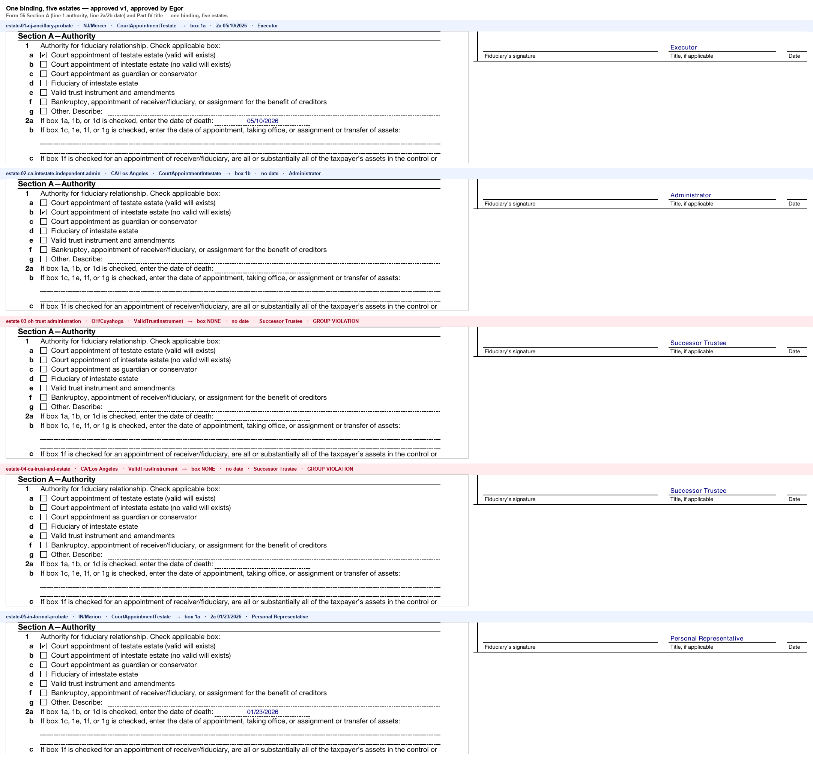

# The reuse proof — one binding, five estates, no model

Binding: `artifacts/approved/irs-f56.v1.json` — approved v1, approved by Egor  
sha256: `bfb26d81951b66a36fb219890a10ec76371608da28fca2af629d428745ffb515`  
Form: `inputs/forms/Form 56 June 2026.pdf` (sha256 asserted equal to the binding's `sourceFormSha256` before every fill)

The same file, byte for byte, produced all five documents below. The data differs, the jurisdiction differs, the probate route differs, the authority differs — the binding does not. Nothing here consults a model: every fill runs inside `forbid_model_calls()`, and the `model calls` column is a counter wired into the model client, not a literal.

| estate | jurisdiction | route | authority.basis | line 1 | line 2a | line 2b | fiduciary title | filled | empty | model calls | elapsed |
|---|---|---|---|---|---|---|---|---|---|---|---|
| estate-01-nj-ancillary-probate | NJ/Mercer | ANCILLARY_PROBATE | `CourtAppointmentTestate` | **1a** | 05/10/2026 | — | Executor | 32 | 35 | **0** | 40 ms |
| estate-02-ca-intestate-independent-admin | CA/Los Angeles | INDEPENDENT_ADMINISTRATION | `CourtAppointmentIntestate` | **1b** | — | — | Administrator | 27 | 40 | **0** | 40 ms |
| estate-03-oh-trust-administration | OH/Cuyahoga | TRUST_ADMINISTRATION | `ValidTrustInstrument` | **NONE** | — | — | Successor Trustee | 25 | 42 | **0** | 41 ms |
| estate-04-ca-trust-and-estate | CA/Los Angeles | TRUST_ADMINISTRATION | `ValidTrustInstrument` | **NONE** | — | — | Successor Trustee | 23 | 44 | **0** | 40 ms |
| estate-05-in-formal-probate | IN/Marion | FORMAL_PROBATE | `CourtAppointmentTestate` | **1a** | 01/23/2026 | — | Personal Representative | 32 | 35 | **0** | 40 ms |

**Model calls at fill time: 0 across all 5 estates.** Wall time 40–41 ms per estate.

## What differs, and why that is the point

- **Line 1** — the authority box moves with `authority.basis`: 1a court appointment of a testate estate (estates 01, 05), 1b intestate (estate 02), 1e valid trust instrument (estates 03, 04). One `condition` binding per box, seven boxes, one `exactlyOne` exclusive group holding them together.
- **Line 2a vs 2b** — the same `when` guard sends the date of death to 2a on the 1a/1b/1d branch and the date of appointment to 2b on the 1c/1e/1f/1g branch. Estates 01/02/05 take one branch, 03/04 the other. No code decided that; a guard in the artifact did.
- **Fiduciary title** — Executor, Administrator, Successor Trustee, Personal Representative, straight from `form56.signature.title`.

## Cold versus warm, honestly

| | wall time | model calls | measured how |
|---|---|---|---|
| Cold: first estate on an uncompiled form | **485 s** (83 s calibrate + 402 s propose) | 4 | calibrate from `out/reports/calls/` mtimes (19:54:16 → 19:55:39); propose from the wall time the command printed (402.0 s) |
| Warm: every estate after the first | **40 ms** (range 40–41) | 0 | measured per fill, this run |

That is roughly **12,065×**. The compile cost is paid once per form, by a machine, under human review. Every estate after it is deterministic.

Two things this table deliberately does not hide:

- The first proposal attempt spent a further **840 s** on two whole-form calls that timed out at 420 s each before the per-page fallback existed. It is excluded from the headline because a run today does not pay it, but it was real time on the clock tonight.
- Cold cost is *build* cost. It buys a reviewed artifact, not one filled form.

## Group violations in this run

**2 estate(s) failed the `exactlyOne` check on line 1.** The fill still produced a PDF and reported the violation rather than filing something with no authority box marked. Detail per estate is in `reuse-v1/<estate>.json`.
- `estate-03-oh-trust-administration` — exclusive group 'Line 1 — authority for filing notice' requires exactly one box marked; 0 are set: (none)
- `estate-04-ca-trust-and-estate` — exclusive group 'Line 1 — authority for filing notice' requires exactly one box marked; 0 are set: (none)
